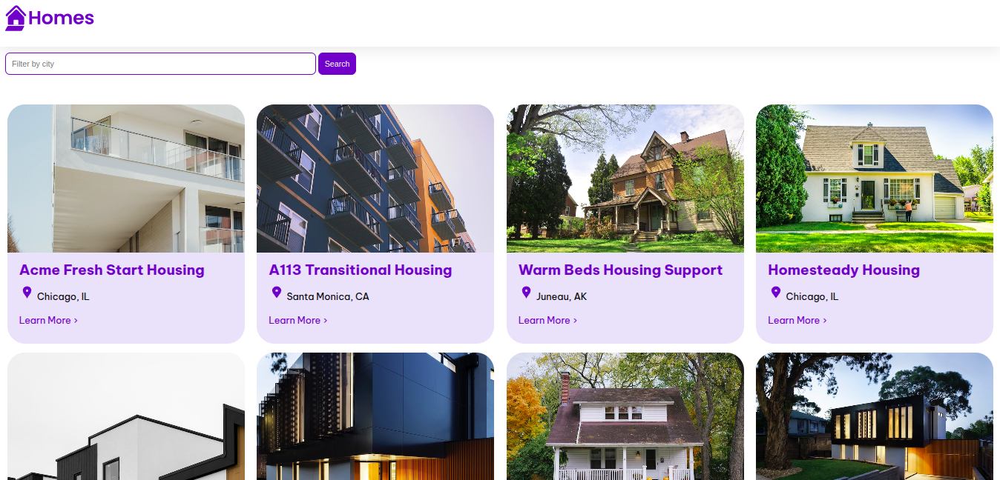
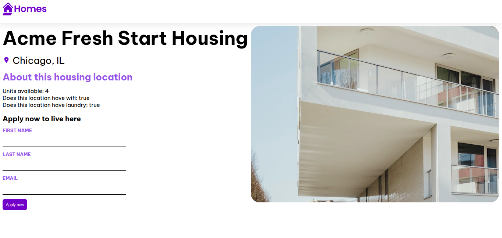
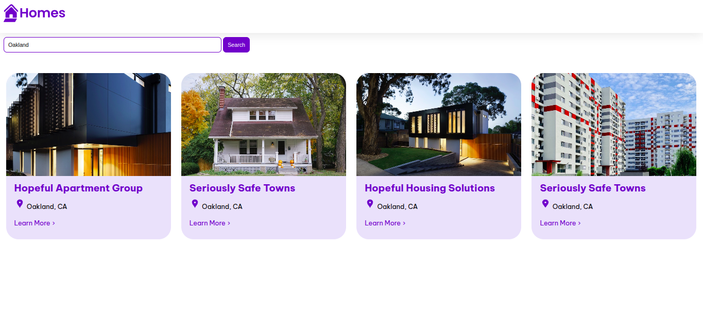
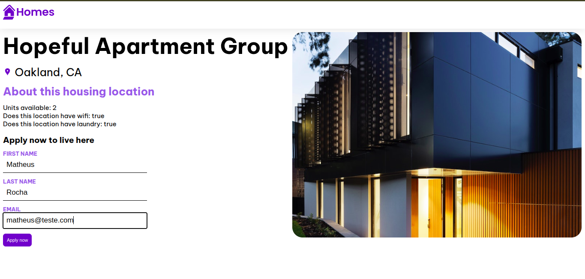

# Angular Housing Location Project

## Descrição do Projeto
Projeto desenvolvido em Angular utilizando JSON Server como backend simulado. Este projeto demonstra o uso de várias funcionalidades modernas do framework Angular, incluindo componentes, serviços, roteamento e formulários reativos.

## Tecnologias
- Angular 19
- JSON Server
- TypeScript
- RxJS
- Angular Router
- Angular Forms

## Funcionalidades do Angular Utilizadas
- Componentes e Módulos
- Serviços e Injeção de Dependência
- Roteamento (Angular Router)
- Formulários Reativos
- Comunicação entre Componentes
- Requisições HTTP utilizando fetch API

## Configuração do Ambiente
1. Clone o repositório
2. Instale as dependências:
```bash
npm install
```
3. Inicie o JSON Server:
```bash
json-server --watch db.json
```
4. Em outro terminal, inicie o servidor de desenvolvimento Angular:
```bash
ng serve --open
```

## Screenshots
### Tela Principal



### Detalhes de uma Casa


### Home com resultados de busca


### Detalhes com o formulário preenchido

