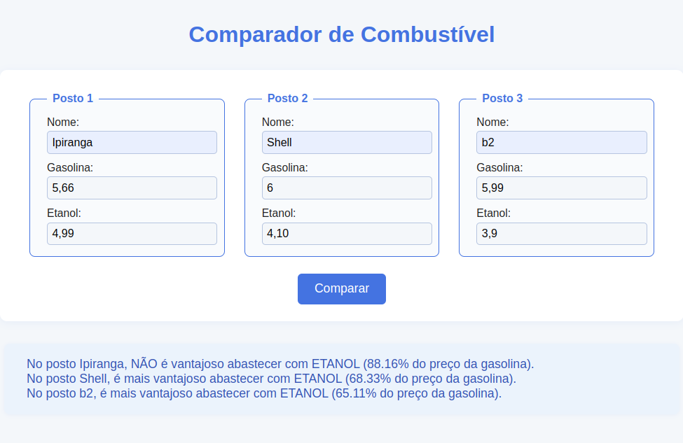

### Comparador de combustível

Crie um script usando os conceitos da Orientação a Objetos na linguagem JavaScript para calcular se é mais vantajoso abastecer o carro com Gasolina ou Etanol em certos postos de combustíveis. Você poderá definir as classes na forma antiga por meio de Função Construtora ou na forma mais recente, a partir do EcmaScript 6, com a palavra-chave "class". Não se deve usar a notação de objetos literais (representação de objetos por um par de chaves {}), uma vez que esta estrutura não representa uma classe da Orientação a Objetos. 

Basicamente, o programa precisa possuir as classes Posto e Combustível. A classe Combustível precisa ter os atributos tipo (GASOLINA ou ETANOL) e preço. Os valores de tipos de combustíveis (GASOLINA e ETANOL) precisam ser declarados como constantes. O atributo preço deve ser um número, uma vez que será usado para cálculo. Por sua vez, a classe Posto precisa ter os atributos nome(nome do posto), gasolina e etanol, sendo que estes dois últimos precisam referenciar os respectivos objetos da classe Combustível.

O cálculo é o seguinte: se "Preço do Etanol"/"Preço da Gasolina" < 0,7 (70%) então é vantajoso abastecer com Etanol. Logicamente, neste cálculo simplista, se está desconsiderando a variação de consumo de cada automóvel com ambos combustíveis. Feito o cálculo, deve ser impresso se é vantajoso ou não abastecer com ETANOL no posto. A impressão deve ocorrer usando a notação de String Template/Template Literals (uso de crase ao invés de aspas e uso de ${} para acessar as variáveis). O cálculo e a impressão devem ocorrer dentro do método sugereCombustivel() da classe Posto. Na frase a ser impressa, deve constar o resultado (porcentagem calculada) da equação.

Após a definição da estrutura de classes, o script precisa instanciar/criar pelo menos três objetos postos com seus respectivos combustíveis, passando os valores por construtor. Então, imprimir as sugestões de combustível por meio da chamada do método sugereCombustivel().  

Enfim, a leitura dos dados pode ocorrer via formulário (renderizado na página principal ou em janela flutuante) ou via window.prompt. A impressão pode ocorrer via console.log, via window.alert ou qualquer outra forma que for mais adequada a apresentação dos dados. A página HTML pode ser mínima, caso não se use um formulário, apenas com a referência para o arquivo JavaScript, ou seja, com a extensão .js. O arquivo HTML não precisa ter texto referente ao domínio do problema.